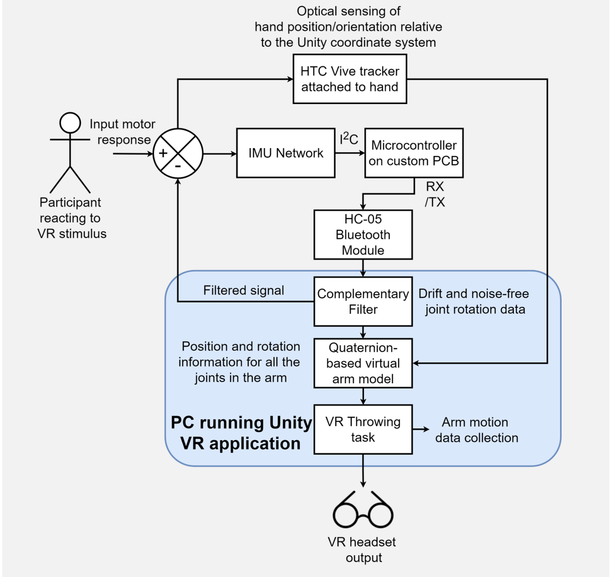
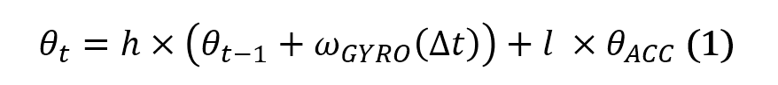
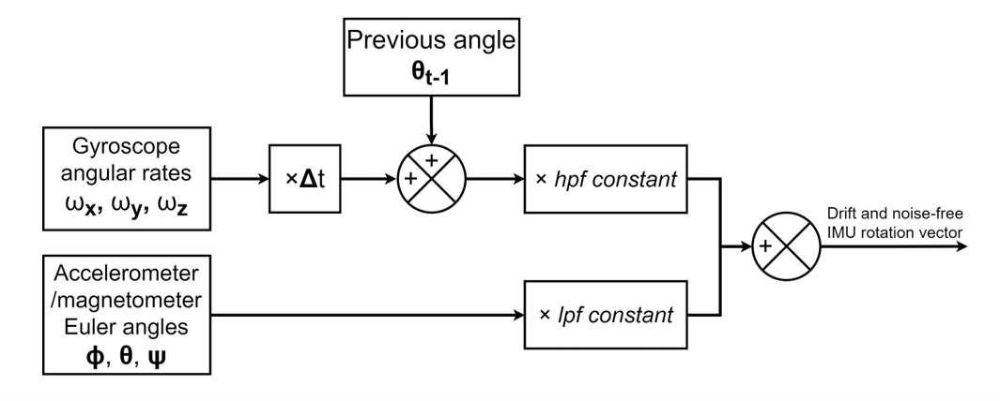
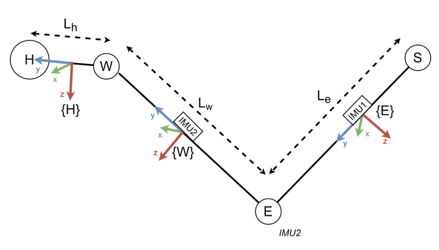
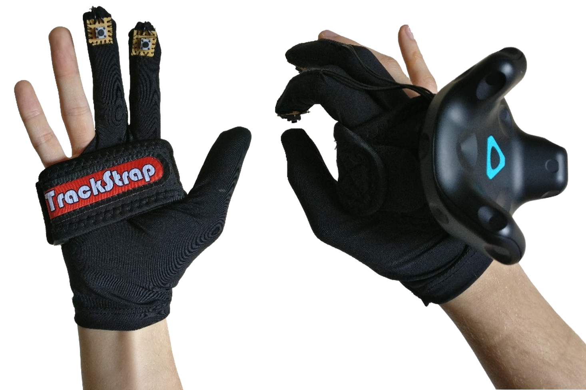
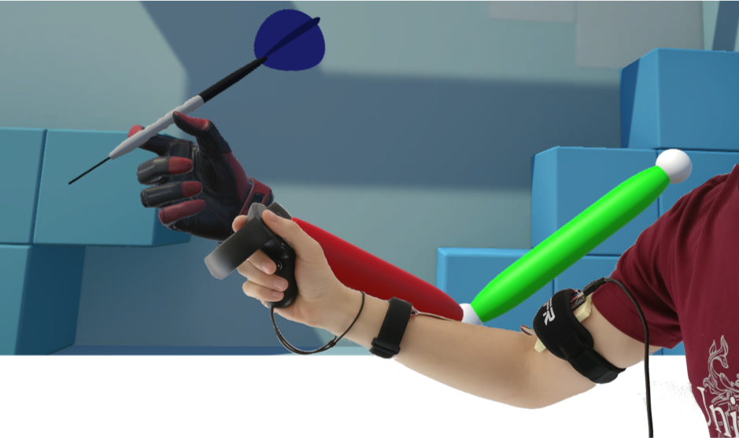
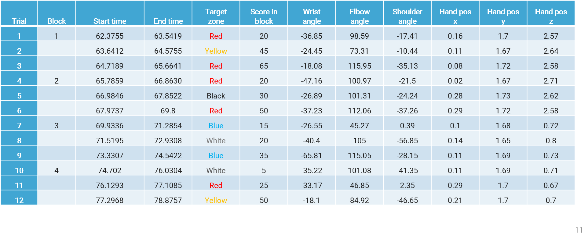
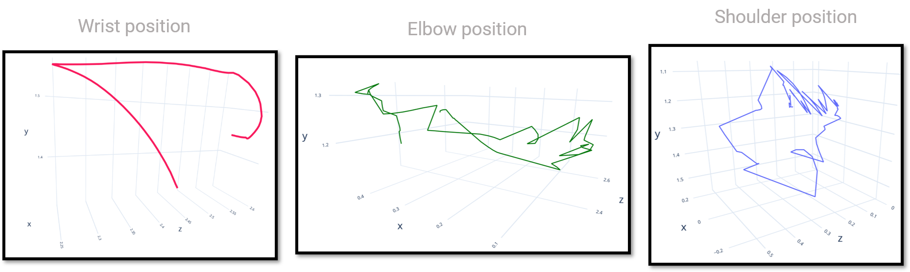

# Embedded Motion-Tracking System for the Human Arm

> **Mechatronics and Robotics (MEng) 3rd Year Individual Project:** _Design of an Embedded Motion-Tracking System for the Human Arm_ 

> **Final Grade:** First Class Honours

This application was built to showcase my 3rd Year University Project: designing a low-cost wearable device enabling full arm tracking in a VR throwing experiment.

<p align="center">
 
</p>

## Background 🌄
VR revolutionized home entertainment over the last decade. Such innovation was promptly followed by the attempts of behavioural researchers at turning the latest VR technology into a tool aimed at investigating human response to different kinds of stimuli in three-dimensional computer-generated environments. However, the lack of support for full limb tracking restricts the scope of the possible studies that would benefit from the versatility of VR platforms.

The understanding of fundamental motor skills such as throwing, lifting or reaching objects is hence often neglected, penalised by the lack of tools allowing to study arm motion on a large scale. The present work was hence run towards the design of to a low-cost wearable device that would allow accurate human arm tracking in VR behavioural experiments. 

## The System ⚙️

<p align="center">
 
</p>

## Complementary IMU Data Filtering 💻

To ensure a virtually drift and noise-free output from the IMUs used to sense joint rotations, a Complementary Filter was implemented, based on the equation below:
<p align="center">
 
 </p>
  
Conceptually, a Complementary Filter involves combining data from all three on-board sensors to obtain a more accurate and drift-free response to the device’s rotation. This can be achieved by applying a high-pass filter and a low-pass filter to the angular data obtained from the gyroscope and accelerometer/magnetometer respectively and in complementary proportions.

 <p align="center">
  
 </p>
 
## Virtually Modelling the Arm
Despite their intuitiveness, Euler rotations suffer from Gimbal lock issues, causing the loss of a degree of freedom when certain rotation sequences are performed. This concern led to recurring to quaternions as a tool to solve this forward kinematics problem. The kinematic chain was hence modelled as shown in the schematic below, using a HTC Vive tracker to set the hand coordinate system as the base frame {H}.

 <p align="center">
 
 </p>

The quaternion for the orientation of each joint obtained from the IMUs could hence be transformed by a 3D vector containing link length information. Given the manually input link lengths, this allowed to translate each joint by the length of the next link in the chain and rotate it based on the IMU input quaternions. 

This method allowed to retrieve the positional 3D coordinates of each joint, offsetting them by the link lengths measured on the participant. Finally, the quaternion components were altered to match the Unity engine frame which is based on a left-handed coordinate system, as opposite to the IMUs. This resulted in each quaternion being input into the Unity game in the following configuration: `[𝑤, 𝑦, −𝑧, −𝑥]`.

## Embedded Device 💡

A Printed Circuit Board (PCB) was designed to encapsulate all the main electronic components that the system required in a small portable package. Designed using the `CAD` software _Eagle_. 

<p align="center">
  
<p/>
 
 The board features a _ATmega328P-AU_ core, 5V power supply via Li-Ion battery (with integrated protection circuitry), a charging circuit managed by a ``MCP73831`` chip and a 4-pin socket for a ``HC-05`` Bluetooth module . Communication with the IMUs acting as daughterboards worn on the player's arm was established using the $I^2C$ protocol.
 
 <p align="center">
  
 </p>

This glove-like VR controller was built taking advantage of the _HTC Vive_ tracker and its _pogo pins_ to enable participants to move their hand in a more naturalistic way while attempting the motor task.

### The Final Hardware System
 <p align="center">
 
 </p>

## The Game 🎯
In software, an object-oriented approach was adopted to animate the VR arm. A `struct` was built, containing kinematic data about each joint, including the previous joint’s ``transform``, link length and link `GameObject`. This also opened up the possibility to implement finger tracking, simply requiring IMUs to be attached to the fingers and new instances of the data structure to be created.

```csharp
public struct Limb
{
  public Transform previousJoint; // Transfrm for the previous joint in the chain
  public Transform joint; // Transform for the current joint
  public Transform link; // Tramsform for the current link
  public float link_length; // length of the current link in m
}
```

<p align="center">
 
</p>

Aided by the  [Unity Experiment Framework](https://github.com/immersivecognition/unity-experiment-framework) (UXF), a behavioural experiment was designed to model dart throwing. The aim was to track behavioural and continuous data throughout each trial (i.e. each dart throw). 

 

The game also maps a computer-generated model of the arm onto the real limb to provide live visual feedback, aiding the participant in perceiving their motion as natural while in VR.

### Overall Software Architecture

 <p align="center">
  
 </p>
 
## Data Output 📈

Experimental data is recorded continuously and discretely throughout the task.


| Behavioural Data                     | Continuous Data                                    |
|--------------------------------------|----------------------------------------------------|
| Dart release time window             | 3D orientation of each joint throughout each trial |
| Zone of the bullseye hit by the dart | 3d Position of each joint throughout each trial    |
| Score after the latest throw         |                                                    |
| Release time window                  |                                                    |
| Hand position at release time        |                                                    |
| 2D Joint Angles at Release Time      |                                                    |
###  Behavioural Results Example

 
### Continuous Results Example
 
 
### Future Works
The main aims of the project were met, successfully achieving tracking of the data points of interest (as mentioned in the software development section) using wearable sensors. The device’s overall functionality was tested in the bespoke Virtual Reality environment developed alongside the hardware. Nevertheless, the following points would benefit from future improvements:

> In terms of overall accuracy, the elbow and shoulder joint continuous positional tracking suffers from some jitter due to error carrying forward as joint positions and rotations are mathematically inferred from the status of the previous joint. This could be improved by adding a second HTC Vive tracker attached to the shoulder and using it as a further point of reference for kinematic calculations.

> Time constraints also impacted the design and additive manufacture of enclosures for the sensors, which were part of the original project plan.

